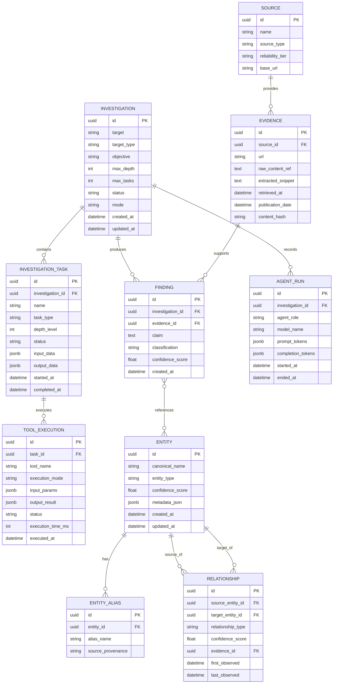

# NEXUS Architecture Specification v1.0

## 1. System Architecture Overview

```mermaid
graph TD
    Client[User / API Client] --> API[FastAPI API Layer /api/v1]
    API --> IM[Investigation Manager Application Layer]
    
    subgraph Core Persistence & State (PostgreSQL)
        IM --> DB[(PostgreSQL Database)]
        DB --> InvT[Investigations & Tasks]
        DB --> EntT[Entities & Aliases]
        DB --> RelT[Relationships & Knowledge]
        DB --> EvT[Evidence & Findings]
        DB --> ToolT[ToolExecutions & AgentRuns]
    end

    subgraph Agentic Orchestration Layer (OpenAI Agents SDK)
        IM --> ManagerAgent[NEXUS Manager / Planner Agent]
        ManagerAgent --> |Tool Invocation| ResearchAgent[Research Specialist]
        ManagerAgent --> |Tool Invocation| OSINTAgent[OSINT Specialist]
        ManagerAgent --> |Tool Invocation| ReconAgent[Recon Specialist]
        ManagerAgent --> |Tool Invocation| VerificationAgent[Verification Specialist]
        ManagerAgent --> |Tool Invocation| IntelAgent[Intelligence Specialist]
        ManagerAgent --> |Tool Invocation| ReportAgent[Report Specialist]
    end

    subgraph Security & Guardrail Boundary
        ManagerAgent -.-> Guardrails[Security Guardrails & Mode Filter]
        Guardrails --> ToolReg[Tool Registry & Policy Enforcer]
    end

    subgraph Source Adapters & External Data
        ToolReg --> AdapterRegistry[Source Adapter Registry]
        AdapterRegistry --> HTTPAdapter[HTTPX Web Fetcher]
        AdapterRegistry --> TrafAdapter[Trafilatura Text Extractor]
        AdapterRegistry --> CRTAdapter[crt.sh Certificate Adapter]
        AdapterRegistry --> ArxivAdapter[ArXiv Research Adapter]
        AdapterRegistry --> SScholAdapter[Semantic Scholar Adapter]
        AdapterRegistry --> WikiAdapter[Wikidata Adapter]
        AdapterRegistry --> SECAdapter[SEC EDGAR Adapter]
        AdapterRegistry --> StubAdapters[External Binary Stubs: Amass, Subfinder, Maigret]
    end

    subgraph Pipeline Infrastructure
        AdapterRegistry --> ER[Deterministic Entity Resolution Engine]
        ER --> RapidFuzz[RapidFuzz String Matcher]
        ER --> DB
    end
```

---

## 2. Database ERD & Schema Design



### PostgreSQL Indexes & Constraints
- `ENTITY`: UNIQUE index on `(canonical_name, entity_type)`.
- `ENTITY_ALIAS`: Index on `(alias_name, entity_id)`.
- `RELATIONSHIP`: Composite index on `(source_entity_id, target_entity_id, relationship_type)`.
- `EVIDENCE`: UNIQUE constraint on `content_hash`. Index on `source_id`.
- `FINDING`: Index on `(investigation_id, classification)`. Index on `evidence_id`.

---

## 3. Agent & Tool Architecture

### OpenAI Agents SDK Pattern
- **Manager Agent**: Controls investigation loop, evaluates state transitions, delegates to specialist agents as function tools.
- **Specialist Agents**:
  1. `ResearchAgent`: Web research, news, public documents, technology signals.
  2. `OSINTAgent`: Professional entities, public repositories, organizations, projects.
  3. `ReconAgent`: Public DNS records, certificate logs, passive infrastructure indicators.
  4. `VerificationAgent`: Claim cross-referencing, contradiction detection, source reliability scoring.
  5. `IntelligenceAgent`: Timeline synthesis, trend analysis, fact vs. inference deduction.
  6. `ReportAgent`: Formats final markdown intelligence reports with cited evidence.

### Tool Registry Specification
Every tool registered in `app/tools/registry.py` defines:

```python
class ToolMetadata(BaseModel):
    name: str
    description: str
    category: str # Research, Web, News, Academic, Company, DNS, Certificate, Technology, OSINT, Recon
    input_schema: type[BaseModel]
    output_schema: type[BaseModel]
    required_mode: str # PASSIVE_PUBLIC | AUTHORIZED_SECURITY_ASSESSMENT
    risk_level: str # LOW | MEDIUM | HIGH
    timeout_seconds: int = 30
    rate_limit_per_minute: int = 60
```

---

## 4. SourceAdapter Architecture

Generic Abstract Interface (`app/sources/base.py`):

```python
from abc import ABC, abstractmethod
from typing import Optional
from pydantic import BaseModel, Field

class RawEvidence(BaseModel):
    source_name: str
    url: Optional[str] = None
    extracted_text: str
    publication_date: Optional[str] = None
    metadata: dict = Field(default_factory=dict)

class ExtractedEntity(BaseModel):
    name: str
    type: str
    aliases: list[str] = Field(default_factory=list)
    confidence: float = 1.0

class ExtractedRelationship(BaseModel):
    source_entity: str
    relationship_type: str
    target_entity: str
    confidence: float = 1.0

class SourceResult(BaseModel):
    success: bool
    evidence: list[RawEvidence] = Field(default_factory=list)
    entities: list[ExtractedEntity] = Field(default_factory=list)
    relationships: list[ExtractedRelationship] = Field(default_factory=list)
    error_message: Optional[str] = None

class SourceAdapter(ABC):
    name: str
    source_type: str

    async def search(self, query: str, limit: int = 10) -> SourceResult:
        return SourceResult(success=True)

    async def fetch(self, target: str) -> SourceResult:
        return SourceResult(success=True)

    def normalize(self, raw_data: str) -> str:
        return raw_data.strip()

    def extract_entities(self, content: str) -> list[ExtractedEntity]:
        return []

    def extract_relationships(self, content: str) -> list[ExtractedRelationship]:
        return []
```

---

## 5. Security & Execution Policy

### Policy Engine (`app/security/policy.py`)
- **Execution Modes**:
  - `PASSIVE_PUBLIC`: Only passive HTTP/REST API calls against public datasets (Default).
  - `AUTHORIZED_SECURITY_ASSESSMENT`: Active network checks (disabled in MVP).
- **Target Boundary Rules**:
  - Enforce explicit RFC 1918 / localhost / private range blocking for passive web research.
  - Require explicit scope domain verification before active recon tools execute.
- **Guardrail Interceptor**:
  - Wraps OpenAI Agents SDK tool execution.
  - Intercepts tool calls before execution; checks tool risk level and required mode against `investigation.mode`. Throws `SecurityPolicyViolation` if unauthorized.

---

## 6. Deterministic Entity Resolution Engine

Hierarchy (`app/services/entity_resolution.py`):

1. **Exact Canonical Match**: Case-sensitive lookup in PostgreSQL `entities` table.
2. **Alias Match**: Lookup against `entity_aliases` table.
3. **Normalized String Match**: Lowercase, stripped punctuation, normalized whitespace.
4. **Fuzzy String Match (`RapidFuzz`)**:
   - Uses `token_sort_ratio`.
   - Threshold >= 90% within the same `entity_type`.
   - Match creates a candidate relationship or merges alias with provenance log.

---

## 7. Python Dependencies (`pyproject.toml`)

```toml
[project]
name = "nexus-backend"
version = "0.1.0"
requires-python = ">=3.11"
dependencies = [
    "fastapi>=0.110.0",
    "uvicorn[standard]>=0.28.0",
    "pydantic>=2.6.0",
    "pydantic-settings>=2.2.0",
    "sqlalchemy[asyncio]>=2.0.28",
    "asyncpg>=0.29.0",
    "aiosqlite>=0.20.0",
    "alembic>=1.13.1",
    "httpx>=0.27.0",
    "trafilatura>=1.8.0",
    "rapidfuzz>=3.6.0",
    "openai>=1.14.0",
    "agents>=0.1.0", # OpenAI Agents SDK
]

[project.optional-dependencies]
dev = [
    "pytest>=8.0.0",
    "pytest-asyncio>=0.23.5",
    "ruff>=0.3.0",
]
```

---

## 8. Proposed Project Directory Structure

```
backend/
├── alembic/                      # Alembic DB migration scripts
│   ├── env.py
│   └── versions/
├── app/
│   ├── __init__.py
│   ├── main.py                   # FastAPI app entrypoint & middlewares
│   ├── api/                      # REST API Layer
│   │   ├── __init__.py
│   │   └── v1/
│   │       ├── __init__.py
│   │       ├── router.py
│   │       ├── health.py
│   │       ├── investigations.py
│   │       └── entities.py
│   ├── core/                     # Core App Configuration & Database
│   │   ├── __init__.py
│   │   ├── config.py             # Pydantic Settings
│   │   └── database.py           # Async SQLAlchemy Engine & SessionLocal
│   ├── security/                 # Execution Policy & Guardrails
│   │   ├── __init__.py
│   │   ├── policy.py
│   │   └── guardrails.py
│   ├── models/                   # SQLAlchemy ORM Models
│   │   ├── __init__.py
│   │   ├── base.py
│   │   ├── investigation.py
│   │   ├── entity.py
│   │   ├── relationship.py
│   │   ├── source.py
│   │   ├── evidence.py
│   │   └── finding.py
│   ├── schemas/                  # Pydantic Schemas
│   │   ├── __init__.py
│   │   ├── investigation.py
│   │   ├── entity.py
│   │   ├── evidence.py
│   │   └── finding.py
│   ├── tools/                    # Tool Registry & Definitions
│   │   ├── __init__.py
│   │   ├── registry.py
│   │   └── definitions/
│   ├── sources/                  # Modular Source Adapters
│   │   ├── __init__.py
│   │   ├── base.py               # Abstract SourceAdapter ABC
│   │   ├── httpx_fetcher.py
│   │   ├── trafilatura_extractor.py
│   │   ├── crt_sh.py
│   │   ├── arxiv.py
│   │   ├── semantic_scholar.py
│   │   ├── wikidata.py
│   │   └── sec_edgar.py
│   ├── agents/                   # OpenAI Agents SDK Layer
│   │   ├── __init__.py
│   │   ├── manager.py            # Main NEXUS Orchestrator Agent
│   │   ├── research_agent.py
│   │   ├── osint_agent.py
│   │   ├── recon_agent.py
│   │   ├── verification_agent.py
│   │   ├── intelligence_agent.py
│   │   └── report_agent.py
│   └── services/                 # Business Logic Services
│       ├── __init__.py
│       ├── investigation_manager.py
│       └── entity_resolution.py
├── tests/                        # Test Suite
│   ├── conftest.py
│   ├── test_health.py
│   ├── test_investigations.py
│   └── test_entity_resolution.py
├── pyproject.toml
└── README.md
```

---

## 9. Implementation Sequence

1. **Phase 1: Domain Architecture & Persistence (Milestone 2)**
   - Update `pyproject.toml` dependencies.
   - Implement `app/core/config.py` (Pydantic Settings) & `app/core/database.py` (Async SQLAlchemy).
   - Write SQLAlchemy ORM models and Alembic initialization.
   - Build REST API endpoints for `/api/v1/investigations` with CRUD operations.

2. **Phase 2: Source Adapters & Entity Resolution (Milestone 3)**
   - Implement `app/sources/base.py` and MVP native adapters (`crt.sh`, `arxiv`, `semantic_scholar`, `wikidata`, `sec_edgar`, `trafilatura`).
   - Build `app/services/entity_resolution.py` using RapidFuzz matching.

3. **Phase 3: Tool Registry & Security Policy (Milestone 4)**
   - Build `app/tools/registry.py` and policy filter for `PASSIVE_PUBLIC` mode.
   - Wrap adapters as OpenAI Agents SDK `@function_tool` definitions.

4. **Phase 4: Agent Orchestration & Execution Loop (Milestone 5)**
   - Build Manager Agent & Specialist Agents (`Research`, `OSINT`, `Recon`, `Verification`, `Intelligence`, `Report`).
   - Implement `app/services/investigation_manager.py` execution loop with budget & depth limits.

---

## 10. Risks & Unresolved Decisions

1. **Database Fallback for Local Dev**:
   - PostgreSQL is required for production, but Docker engine was found inactive on local system.
   - *Mitigation*: Configure `aiosqlite` SQLite backend for automated pytest runs while maintaining PostgreSQL compatibility for staging/production via SQLAlchemy 2.0.
2. **Third-Party API Rate Limits**:
   - `crt.sh`, `ArXiv`, `Semantic Scholar`, `SEC EDGAR` enforce rate limits and require custom `User-Agent` headers.
   - *Mitigation*: Embed strict rate-limiting and retry logic inside `httpx` async calls.
